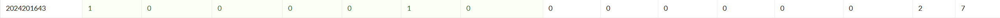

# bomblab 报告

姓名：曾肃中

学号：2024201643

| 总分 | phase_1 | phase_2 | phase_3 | phase_4 | phase_5 | phase_6 | secret_phase |
| ---- | ------- | ------- | ------- | ------- | ------- | ------- | ------------ |
|   7  | 1       | 1      | 1      | 1       | 1       | 1       | 1           |


scoreboard 截图：



<!-- TODO: 用一个scoreboard的截图，本地图片，放到 imgs 文件夹下，不要用这个 github，pandoc 解析可能有问题 -->

## 解题报告

<!-- 对你拆掉的每个phase进行分析，并写出你得出答案的历程 -->

<!-- 如果能用伪代码还原题目源代码最佳（不属于先前提到的大段代码），语言描述自己的分析也可，每道题目的图片不建议超过两张 -->

### phase_1

```c
// Truth or false, it's the logic that dictates all. Rising edge ticks the clock, stimulates your flip-flop.
```

代码段

```
1440:   call   1d0c <strings_not_equal>
1445:   test   %eax,%eax
1447:   jne    144e <phase_1+0x19>
```

这一眼就是对比字符串，`call strings_not_equal` 只要返回值不为0（不相等），`jne` 就会跳去爆炸，所以必须得完全一样才行。

****

代码段

```
1439:   lea    0x1d40(%rip),%rsi        # 3180 <_IO_stdin_used+0x180>
```

这里把一个地址传给了 `%rsi`， 没啥好分析的，查 `0x3180` 里面的字符串，那就是要输的答案。


### phase_2

```c
// 733173 1264602 657441 1103229
```

**开头一看：**

代码段

```
  146b:     mov   %rsp,%rdx
  146e:     lea   0x4(%rsp),%rcx
  1473:     lea   0xc(%rsp),%r9
  1478:     lea   0x8(%rsp),%r8
  1484:     call  1150 __isoc99_sscanf@plt
  1489:     cmp   $0x4,%eax
  148c:     jne   14a2 <phase_2+0x4d> #不满足就爆炸
```

读入了四个数，并且都是存在 `%rsp` 到 `0xc(%rsp)` 这块栈空间里。

接着看加载部分：

代码段

```
  lea   0x4cab(%rip),%rdi     # 6140 <matA.3>
  lea   0x4c5e(%rip),%rsi     # 6120 <matB.2>
```

看出来是读入了 `matA` 和 `matB` 两个矩阵

然后是一堆初始化：

代码段

```
  mov   $0x0,%r11d
  mov   $0x0,%r8d
  mov   $0x0,%eax
  mov   $0x0,%ecx
  mov   $0x0,%ebx
```

一共是给这几个计数器和累加的玩意都初始化为0了。

又有指针的操作：

代码段

```
  lea   0x10(%rsp),%rbx
  lea   0x10(%rsp),%rbp 
  mov   %rbx,%r9
  mov   %r9,%r10
```

并且最后进行了对比：

代码段

```
  mov   0x0(%rbp,%rbx,1),%eax
  cmp   %eax,(%rsp,%rbx,1)
```

所以很明显，逻辑是用 %rsp~0xc(%rsp)，和 0x10(%rsp)~0x1c(%rsp)做对比。

那么 rbp 就是记录计算结果最开始的地址，rbx 在这里充当了是个行下标，而 r9、r10 是用来定位具体计算结果写到哪里的指针。

再看循环逻辑：

代码段

```
  mov   $0x0,%eax
  mov   $0x0,%ecx
  mov   (%rdi,%rax,4),%edx
  imul  (%rsi,%rax,8),%edx
  add   %edx,%ecx           # 累加操作
  add   $0x1,%rax
  cmp   $0x3,%rax
```

配合外层的更新：

代码段

```
  add   $0x1,%r11d
  add   $0xc,%rdi
  add   $0x8,%rbx
  cmp   $0x2,%r11d          # 外层循环 i
```

和中间层的更新：

代码段

```
  add   $0x1,%r8d
  add   $0x4,%r9
  add   $0x4,%rsi
  cmp   $0x2,%r8d           # 中间循环 j
```

不难看出这就是标准的矩阵乘法。`r8d` 是列坐标 `j`，`r11d` 是行坐标 `i`，`%eax` 是内层循环变量 `k`，`%ecx` 果然就是累加器。

那么最后对比的结果其实就存放在 `0x10(%rsp)` 开始的那块内存里，我们要输入的，就是算出来的那些数字。


### phase_3

```c
// 0 E 135
```

------

**还是开头：**

代码段

```
  1558:     lea    0xf(%rsp),%rcx       # 参数4: 存char的地址
  155d:     lea    0x10(%rsp),%rdx      # 参数3: 存第1个int的地址
  1562:     lea    0x14(%rsp),%r8       # 参数5: 存第2个int的地址
  156e:     call   1150 <__isoc99_sscanf@plt>
  1573:     cmp    $0x2,%eax
  1576:     jle    15a1 <phase_3+0x5d>  # 读入数量不够就炸
```

一眼就看出读入了三个东西：0x10(%rsp)， 0xf(%rsp)， 0x14(%rsp)。

根据偏移量和后面的比较逻辑，大概率格式是 int、char、int（因为 0xf -0x10是1字节，0x10-0x14是4字节）。

**关键逻辑：**

代码段

```
  1582:     cmpl   $0x7,0x10(%rsp)      # 检查第1个整数
  1587:     ja     1692                 # 大于7就爆炸
```

说明第一个数（假设叫它 `x`）必须是 **0 到 7** 之间的数字。

**Switch 跳转表：**

代码段

```
1591:	lea    0x1cc8(%rip),%rdx        # 3260 <_IO_stdin_used+0x260>
1598:    movslq (%rdx,%rax,4),%rax
159c:    add    %rdx,%rax
159f:     jmp    *%rax                
```

根据 `x` 的值（0-7），跳到不同的地方去执行。随便挑一个分支看，比如 `x=0` 的时候：

代码段

```
  15a8:     mov    $0x65,%eax           # 给 eax 赋值 0x65 ('e')
  15ad:     cmpl   $0x87,0x14(%rsp)     # 拿 0x87 (135) 和第2个整数比较
  15b5:     je     169c                 # 相等就去结尾检查
```

这里很明显了：如果x是 `0`，那第二个数必须填 `135`，同时记录下字符应该是 `'e'`。

再看其他分支也是一样的套路，比如 奶龙`=1` 时，对比的是 `0x15b` (347)，字符是 `'f'`。

**最后的字符检查：**

代码段

```
  169c:     cmp    %al,0xf(%rsp)        # 拿 switch 里设置的字符和输入的字符对比
```

代码段

```
  1578:     mov    0x4b92(%rip),%eax    # 6110 <mask.1>
  157e:     xor    %al,0xf(%rsp)        # 把输入的字符和 mask 进行异或运算！
```

**分析：**

1. 读入了一个叫 `mask.1` 的东西到 `%eax`。
2. 然后用 `xor` 指令，把我们输入的字符（在 `0xf(%rsp)`）和这个 mask  xor了 。

**下断点**：`b *0x000055555555557e`，查看寄存器发现掩码是0x20，又因为e是0x65，那0x65  xor 0x20=0x45=E

所以0 E 135


### phase_4

```c
// 31 AC
```

------

**依旧看开头：**

代码段

```
  17a8:     call   1150 <__isoc99_sscanf@plt>
  17ad:     cmp    $0x2,%eax
  17b0:     jne    181f <phase_4+0x9d>  # 没读够2个就炸
```

这很明显，要输入两个参数。

这两个参数存在栈上的 0xc(%rsp) 和 0x10(%rsp)。

**第一个参数：简单的数学题**

代码段

```
  17b2:     mov    $0x5,%edi            # 传参 5
  17b7:     call   16c3 <func4_1>       # 调用递归函数 func4_1
  17bc:     cmp    %eax,0xc(%rsp)       # 算出来的结果必须等于第1个输入
```

进去瞄一眼 `func4_1`，发现是一个典型的递归：

代码段

```
  16df:     lea    0x1(%rax,%rax,1),%eax  # return 2 * res + 1
```

设断点，看 %eax 返回啥就行了。

结论：第1个参数是 31。

**第二个参数：生成的字符串**

代码段

```
  17c2:     lea    0x10(%rsp),%rdi
  17c7:     call   1cef <string_length>
  17cc:     cmp    $0x2,%eax            # 长度必须是 2
```

把第2个参数当**字符串**处理，且长度要是2。

接着看核心生成逻辑：

代码段

```
  17d9:     mov    $0x42,%r8d           # 'B'
  17df:     mov    $0x43,%ecx           # 'C'
  17e4:     mov    $0x41,%edx           # 'A'
  17e9:     mov    $0x1c,%esi           # 28
  17ee:     mov    $0x5,%edi            # 5
  17f3:     call   16e9 <func4_2>       # 调用汉诺塔递归
```

最后对比：

代码段

```
  1800:     call   1d0c <strings_not_equal>
```

意思是，程序用参数 `(5, 28, A, C, B)` 跑了一遍 `func4_2`，生成了一个字符串，我们要输入的必须和它一样。

程序跑完 `func4_2` 后，生成的标准答案就放在栈里（`0x14(%rsp)`

直接设断点，看 %eax 返回啥就行了。

所以是AC

31 AC

### phase_5

```c
// kepfgh
```

------

###  依旧先看开头

代码段

```
  1834:     call   1cef <string_length>
  1839:     cmp    $0x6,%eax
  183c:     jne    1886 <phase_5+0x62>  # 长度不是6就炸
```

所以输入必须是 6 个字符

### 查表替换 

代码段

```
  1850:     movzbl (%rbx,%rax,1),%ecx   # 取出输入字符 Input[i]
  1854:     and    $0xf,%ecx            # 取低4位 (Mask = 0x0F)
  1857:     movzbl 0x3341(%rip),%edx    # 取出 array.1[index] 查表
                                        # 注意：0x3341(%rip) 指向的是一个字符数组
  185e:     mov    %dl,(%rsp,%rax,1)    # 把查到的字符存起来
```

**分析：**

1. 程序依次取出我们输入的每个字符。
2. `and $0xf`：只保留字符的最后 4 位二进制数（范围 0-15）。
3. 以这个 0-15 的数作为 **索引 (Index)**，去一个叫 `array.1` 的数组里查字符。
4. 把查到的新字符拼成一个新的字符串。

### 最后校验

循环结束后：

代码段

```
  186d:     mov    $0x10,%esi           
  1872:     lea    0x331b(%rip),%rsi    # 4b94 <string.2>
  1879:     call   1d0c <strings_not_equal>
```

这里要把生成的新字符串和一个内置字符串比较。 直接用 GDB 查看 `0x4b94` 里的内容： `(gdb) x/s 0x555555554b94` 结果是：**"oilers"**

### 推导原文

设断点获取字典内容

字典内容：`m a d u i e r s n f o t v b y l` 对应的索引：`0 1 2 3 4 5 6 7 8 9 10 11 12 13 14 15`

 "oilers" 对应的索引：

- **o** 索引 10
- **i**  索引 4
- **l** 索引 15
- **e**  索引 5
- **r**  索引 6
- **s**  索引 7

易知输入的低 4 位 = 索引 + 1。

- 要索引 **10**  找低位 **11** (0xB) **k**
- 要索引 **4**  找低位 **5** (0xB) **e**
- 要索引 **15**  找低位 **0**   **p**
- 要索引 **5** 找低位 **6**  **f**
- 要索引 **6**  找低位 **7**  **g**
- 要索引 **7**  找低位 **8**  **h**

答案：

kepfgh


### phase_6

```c
// 1 5 2 3 6 4 hidden
```

####  **依旧先看开头**

一上来调用 read_six_numbers，肯定是要输入 6 个整数。

接着是一堆双重循环（1906 - 193f）：

代码段

```
  192e:     sub    $0x1,%eax
  1931:     cmp    $0x5,%eax
  1934:     ja     18ff                 # 如果 (x-1) > 5，即 x > 6，炸！
```

输入的 6 个数必须是 1 到 6 的全排列

#### 2. 

代码段

```
  194e:     lea    0x48cb(%rip),%rdx    # 加载 node1 的地址 (0x6220)
  ...
  1965:     mov    %rdx,0x20(%rsp,%rsi,8) # 把找到的节点指针存到栈上
```

 6 个节点：`node1` 到 `node6`。

输入 `1`，就取 `node1`；输入 `2`，就取 `node2`。

代码段

```
  197e:     mov    %rax,0x8(%rbx)       # Current->Next = Next_Node
```

把链表按照我们输入的顺序重新连接

#### 3. 

代码段

```
  19b5:     mov    0x8(%rbx),%rbx       # 指向下一个节点
  19be:     mov    0x8(%rbx),%rax       # 取下下个节点？不，这是取Next
  19c2:     mov    (%rax),%eax          # 取 Next_Node 的值 (Value)
  19c4:     cmp    %eax,(%rbx)          # 比较 Current_Value 和 Next_Value
  19c6:     jge    19b5                 # 如果 Current >= Next，继续检查
  19c8:     call   explode_bomb         # 如果 Current < Next，炸
```

按照节点的值，从大到小排序

### 4. 

**找出 6 个节点的值，排序。**。

(gdb) x/20d 0x6220 

对应索引序列：

4, 2, 6, 3, 1, 5

Final Answer:

4 2 6 3 1 5

### phase_7

```c
// cccaa
```

### 寻找入口

`phase_defused`

代码段

```
  222f:     lea    0x13fb(%rip),%rsi    # 加载字符串
  2236:     call   strings_not_equal    # 和输入做对比
  223d:     jne    2207                 # 不相等就跳过
  225c:     call   secret_phase         # 相等就进入隐藏关
```

程序在检查 Phase 6 的答案字符串后面，是否有对应的字符串

(gdb) x/s 0x555555553631

得到"hidden"

4 2 6 3 1 5 hidden

------

### func7 的位移表 

secret_phase ，读入一行字符串，然后调用 func7。

代码段

```
  1a10:     movl   $0xfffffffe,(%rsp)       # 0(%rsp) = -2
  ...
  1b42:     add    (%rsp,%rsi,4),%r8d       # NewRow = OldRow + Table_Row[Index]
  1b49:     add    0x20(%rsp,%rsi,4),%r11d  # NewCol = OldCol + Table_Col[Index]
```

 %rsi 是输入字符模 8 后的值

0(%rsp) 开始的是 行变化，0x20(%rsp) 开始的是 列变化

gdb查看栈内容 x/32d $rsp，或者直接读汇编数数：

| **输入 ** | **偏移0** | ** 偏移32** | **移动效果** |
| --------- | --------- | ----------- | ------------ |
| **0**     | -2        | +1          | 行-2, 列+1   |
| **1**     | -1        | +2          | 行-1, 列+2   |
| **2**     | +1        | +2          | 行+1, 列+2   |
| **3**     | +2        | +1          | 行+2, 列+1   |
| **4**     | +2        | -1          | 行+2, 列-1   |
| **5**     | +1        | -2          | 行+1, 列-2   |
| **6**     | -1        | -2          | 行-1, 列-2   |
| **7**     | -2        | -1          | 行-2, 列-1   |


------

### 地图 

代码段

```
  1baa:     lea    0x45ff(%rip),%rsi    # 61b0 <row0>
  ...
  1bb5:     mov    0x8(%rsi),%rsi       # 遍历链表找对应的行
  ...
  1bc8:     cmpb   $0x1,(%rsi,%rdx,1)   # 检查 Row[Col] 是否为 1
```

1. 地图的每一行是一个链表节点。
2. `0x61b0` 是第 0 行的头结点。
3. 每个节点的前 8 个字节是这一行的 8 个格子，第 8 个字节往后是指向下一行的指针。

(gdb) x/8bx 0x61b0 

(gdb) x/gx 0x61b0 + 8  -> 拿到地址后再 x/8bx

重复 8 次

得到

- **Row 0:** `0 0 1 0 0 1 0 0` (Cols 2, 5 墙)
- **Row 1:** `0 0 0 1 0 0 0 1` (Cols 3, 7 墙)
- **Row 2:** `1 0 1 0 0 1 0 0` (Cols 0, 2, 5 墙)
- **Row 3:** `1 0 0 0 0 0 0 0` (Col 0 墙)
- **Row 4:** `0 1 0 0 1 0 1 0` (Cols 1, 4, 6 墙) ****
- **Row 5:** `1 0 0 1 1 0 0 0` (Cols 0, 3, 4 墙)
- **Row 6:** `0 0 0 0 0 1 0 1` (Cols 5, 7 墙)
- **Row 7:** `1 1 0 0 0 0 0 0`

从 **(0,0)** 走到 **(4,7)**，避开所有的 `1`。

`3 -> 3 -> 3 -> 1 -> 1`

输入的是字符，让它们的 ASCII 低 3 位 对应上面的序列。

**3**  对应`c` (0x63)

**1** 对应 `a` (0x61)

Final Answer:

cccaa

### .....

## 反馈/收获/感悟/总结

<!-- 这一节，你可以简单描述你在这个 lab 上花费的时间/你认为的难度/你认为不合理的地方/你认为有趣的地方 -->

<!-- 或者是收获/感悟/总结 -->

<!-- 200 字以内，可以不写 -->

## 参考的重要资料

<!-- 有哪些文章/论文/PPT/课本对你的实现有重要启发或者帮助，或者是你直接引用了某个方法 -->

<!-- 请附上文章标题和可访问的网页路径 -->